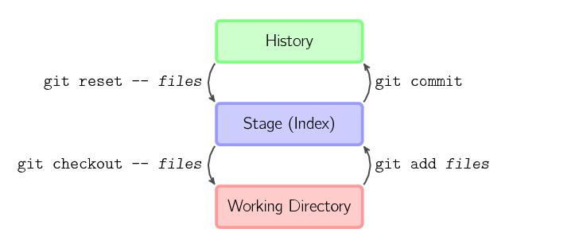

# GitTour


### 一、Git 简介

Git——最流行的分布式版本控制系统。

#### 分布式（Git） VS. 集中式（CVS、 SVN）

CVS 和 SVN属于集中式版本控制系统，集中式版本控制系统最大的毛病就是必须要联网才能工作。

Git 属于分布式版本控制系统。
首先，分布式版本控制系统根本没有“中央服务器”，每个人的电脑上都是一个完整的版本库，这样，你工作的时候，就不需要联网了，因为版本库就在你自己的电脑上。因为每个人电脑上都有一个完整的版本库，所以非常适合多人协作。

和集中式版本控制系统相比，分布式版本控制系统的安全性要高很多，因为每个人电脑里都有完整的版本库，某一个人的电脑坏掉了不要紧，随便从其他人那里复制一个就可以了。

Git 还有一个优势就是极其强大的分支管理。

### 二、Git 的安装
- Linux
- Mac OS
- Windows


### 三、一些概念


#### 1. 工作区和暂存区

- 工作区（Working Directory）：在 git 管理下的普通文件夹都算是工作区，我们平时的编辑工作都是在工作区完成。
- 暂存区（Stage）：临时区域，里面存放将要提交文件的快照。工作区所在的目录下有一个隐藏目录`.git`，这个不算工作区，而是Git的版本库。Git的版本库里存了很多东西，其中最重要的就是称为 stage（或者叫index）的暂存区，还有Git为我们自动创建的第一个分支 master，以及指向master的一个指针叫 `HEAD`。
- 历史记录（History）：保存 git commit 的记录区。


我们把文件往Git版本库里添加的时候，是分两步执行的：
- 第一步是用 `git add` 把文件添加进去，实际上就是把文件修改添加到暂存区；
- 第二步是用 `git commit` 提交更改，实际上就是把暂存区的所有内容提交到当前分支。

因为我们创建 Git 版本库时，Git自动为我们创建了唯一一个 master 分支，所以，现在，git commit就是往master分支上提交更改。

你可以简单理解为，**需要提交的文件修改通通放到暂存区，然后，一次性提交暂存区的所有修改**（没有被添加到暂存区的修改是不会被提交的）。




#### 2. 远程仓库（Remote repositories）

在使用 Git 进行多人协同工作时，一般会有一台电脑充当服务器的角色，每天24小时开机，其他每个人都从这个“服务器”仓库克隆一份到自己的电脑上，并且各自把各自的提交推送到服务器仓库里，也从服务器仓库中拉取别人的提交。

这个“服务器”仓库就是一个远程仓库。

**推荐阅读：**

- [Git Basics - Working with Remotes](https://git-scm.com/book/en/v2/Git-Basics-Working-with-Remotes)

#### 3. SSH key

一般本地 Git 仓库和远程 Git 仓库之间的传输是通过 SSH 加密的，所以需要设置一下 SSH key。

为什么GitHub需要SSH Key呢？因为GitHub需要识别出你推送的提交确实是你推送的，而不是别人冒充的，而Git支持SSH协议，所以，GitHub只要知道了你的公钥，就可以确认只有你自己才能推送。

当然，GitHub允许你添加多个Key。假定你有若干电脑，你一会儿在公司提交，一会儿在家里提交，只要把每台电脑的Key都添加到GitHub，就可以在每台电脑上往GitHub推送了。


#### 4. GitHub


如果你先在本地创建了 Git 仓库，然后又在 GitHub 上创建了一个远程仓库，如何将本地的 Git 仓库跟 GitHub 上的 Git 仓库关联起来？

```
# push an existing repository from the command line

$ git remote add origin git@github.com:ShannonChenCHN/GitTour.git
$ git push -u origin master
```

由于远程库是空的，我们第一次推送master分支时，加上了-u参数，Git不但会把本地的master分支内容推送的远程新的master分支，还会把本地的master分支和远程的master分支关联起来，在以后的推送或者拉取时就可以简化命令。

比如，以后只要本地作了提交，就可以通过命令：

```
$ git push origin master
```
把本地 master 分支的最新修改推送至 GitHub 上的远程仓库了。

#### 5. 分支（Branching）

分支特性能够让我们在不影响“主线开发进程”的情况下，去继续做一些其他开发任务，并且在最终可以将结果合并到“主开发进程”上。

Git 的分支功能是一个能够秒杀其他版本控制系统的 feature，其特点在于轻量、即时、快速。很多其他的 VCS 工具也可以实现分支开发，但是都是需要将整个项目代码重新拷贝一份，这样既低效又费时，而且还占用大量空间。

##### 5.1 分支的本质

分支的本质实际上是指针的控制，切换和合并分支实际上是调整相关指针的指向。

每次提交，Git 都把它们串成一条时间线，master 分支对应的 master 指针，指向最近的一次提交，而 HEAD 指针指向的是当前分支。

（1）提交：每次提交，当前分支都会向前移动一步，这样，随着你不断提交，当前分支的线也越来越长。

```
            HEAD
              ↓
            master
              ↓
----o----o----o
             
注：圆圈“o”代表一次 commit

```

（2）创建并切换到新分支：执行 `checkout -b dev` 时，Git 新建了一个指针叫 dev，指向 master 相同的提交，再把 HEAD 指向 dev，就表示当前分支在 dev 上。

```
            master
              ↓
----o----o----o
              ↑
             dev
              ↑
            HEAD

```

（3）切换分之后的提交：每新提交一次，dev 指针和 HEAD 指针往前移动一步，而 master 指针不变。

```
            master
              ↓
----o----o----o~~~~●
                   ↑
                  dev
                   ↑
                 HEAD

```
（4）合并分支：把 dev 合并到 master 上，其实就是直接把 master 指向 dev 的当前提交。

```
                master
                   ↓
----o----o----o~~~~●
                   ↑
                  dev
                   ↑
                 HEAD

```

（5）删除分支：删除 dev 分支就是把 dev 指针给删掉，删掉后，我们就剩下了一条 master 分支。

```
                master
                   ↓
----o----o----o~~~~●
```

**推荐阅读：** 
           
- [创建和合并分支 - 廖雪峰的官方网站](https://www.liaoxuefeng.com/wiki/0013739516305929606dd18361248578c67b8067c8c017b000/001375840038939c291467cc7c747b1810aab2fb8863508000)
- [Git Branching - Branches in a Nutshell](https://git-scm.com/book/en/v2/Git-Branching-Branches-in-a-Nutshell)


#### 5.2 分支管理


直接使用 `git merge` 合并分支时，默认情况下，Git 执行“快进式合并”（fast-farward merge），会直接将 master 分支指向 dev 分支。

```
$ git merge dev
Updating f1ed183..717b632
Fast-forward
 README.md | 62 +++++++++++++++++++++++++++++++++++++++++++++++++++++--------
 1 file changed, 54 insertions(+), 8 deletions(-)
```


另一种合并分支的方式是 `git merge --no-ff dev`，使用 `--no-ff` 参数后，会执行正常合并，并在 master 分支上生成一个新节点，也就是生成一个新的 commit，这样从分支历史上就可以看出分支信息（加上 `-m` 参数，可以把 commit 注释同时写上去）。

```
$ git merge --no-ff -m "merge with no-ff" dev
Merge made by the 'recursive' strategy.
 README.md | 14 ++++++++++++++
 1 file changed, 14 insertions(+)
```


**详细图解：**
<div style="width: 50%; margin: 0 auto;">Hello</div>
<div align="center"></div>
<p><center>合并前</center></p>
 
<div align="center"></div>
<p><center>使用 git merge 合并</center></p>


<div align="center"></div>
<p><center>使用 git merge --no-off 合并</center></p>

**推荐阅读：**

- [Git分支管理策略](http://www.ruanyifeng.com/blog/2012/07/git.html)
- [Understanding the Git Workflow](https://sandofsky.com/blog/git-workflow.html)

### 四、命令

#### 1. 基本
- `git init`，初始化一个Git仓库
- `git add <file>`，添加文件修改内容到暂存区
- `git stage <file>`，git add 的同义命令
- `git rm <file>`，删除文件后，将修改内容同步到暂存区，用 git add 也可实现同样的效果
- `git commit [-m <msg>]`，把修改后的内容提交到仓库
- `git status`，工作区当前的状态
- `git diff`，查看修改内容
- `git log`，查看 commit 历史记录，以便确定要回退到哪个版本
- `git reflog`，查看 HEAD  修改的历史记录，可以用来切换到以前的某次 commit 版本


#### 2. 撤销
- `git checkout -- <file>`，可以丢弃工作区的修改，也就是撤销 `git add` 的操作
- `git reset HEAD <file>`，把暂存区的修改撤销掉（unstage），重新放回工作区，也就是撤销`git commit` 的操作
- `git reset --hard <commit>`，切换到某个指定的 commit 版本（HEAD 指向的版本就是当前版本，当然，严格来讲，HEAD 是指向的不是提交而是当前分支）

#### 3. 分支
- `git branch`，查看当前分支
- `git branch <banch-name>`，创建新分支
- `git checkout <branch-name>`，切换分支
- `git checkout -b <branch-name>`，创建+切换分支
- `git merge <branch-name>`，合并分支到当前分支
- `git merge --on-ff <branch-name>`，合并分支到当前分支，同时创建一个新的 commit
- `git branch -d <branch-name>`，删除分支
- `git log --graph`，查看分支合并图

### 五、解决冲突

当因为两个不同分支修改了相同文件而导致 Git 无法自动合并分支时，就必须首先解决冲突。解决冲突后，再提交，合并完成。

解决冲突就是把 Git 合并失败的文件手动编辑为我们希望的内容，再提交。Git 会用 `<<<<<<<`，`=======`，`>>>>>>>` 标记出不同分支的内容。


```
                    HEAD
                     ↓
                   master
                     ↓
----o----o----o--o---●
               \    /
                \  / 
                 o
                 ↑
              feature_01

```

### 参考
- [廖雪峰的官方网站](https://www.liaoxuefeng.com/wiki/0013739516305929606dd18361248578c67b8067c8c017b000)
- [Pro Git](https://git-scm.com/book/zh/v2)
